  
  
  

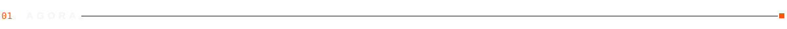

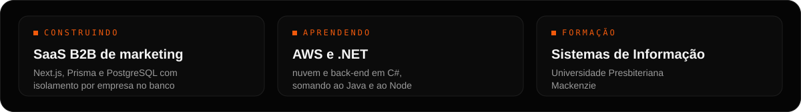


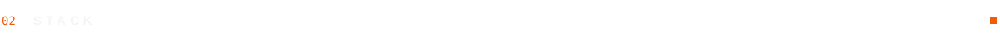


<a href="https://github.com/KaioNacamura/lead-capture-api">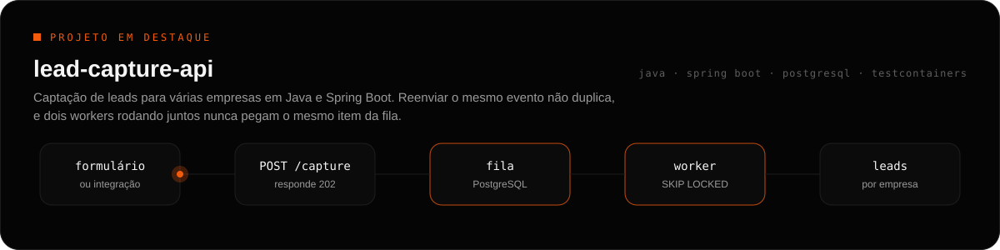</a>

  <a href="https://github.com/KaioNacamura/multi-tenant-rls">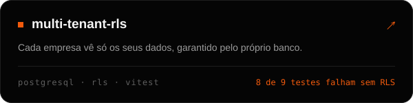</a>
  <a href="https://github.com/KaioNacamura/ci-pipeline-template">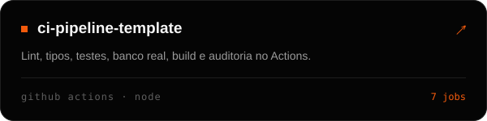</a>
  <a href="https://github.com/KaioNacamura/sql-index-lab">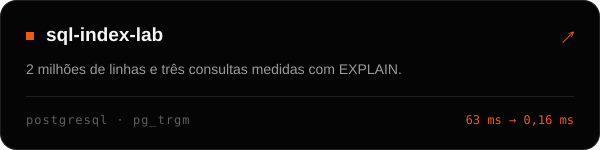</a>
  <a href="https://github.com/KaioNacamura/auth-sessions-lab">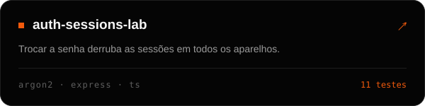</a>

Também: <a href="https://github.com/KaioNacamura/safe-upload">safe-upload</a> · <a href="https://github.com/KaioNacamura/java-fundamentos">java-fundamentos</a> · <a href="https://github.com/KaioNacamura/nexokit">nexokit</a> · <a href="https://github.com/KaioNacamura/segundo-cerebro-template">segundo-cerebro-template</a>

<picture>
  <source media="(prefers-color-scheme: dark)" srcset="https://raw.githubusercontent.com/tobiasmeyhoefer/tobiasmeyhoefer/output/github-snake-dark.svg" />
  <source media="(prefers-color-scheme: light)" srcset="https://raw.githubusercontent.com/tobiasmeyhoefer/tobiasmeyhoefer/output/github-snake.svg" />
  
</picture>
